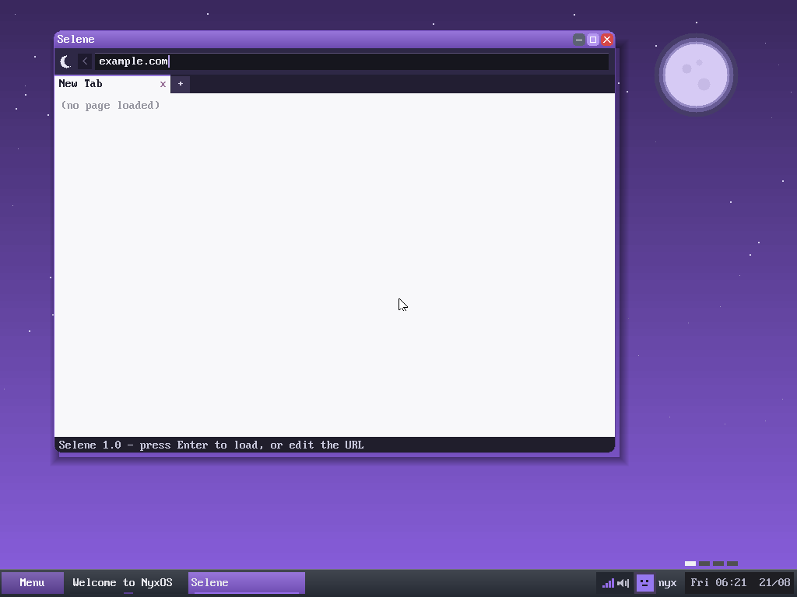

  

<strong>The web browser of NyxOS — HTTP and HTTPS over a from-scratch TLS stack, rendered from scratch.</strong>

  
  &nbsp;
  
  &nbsp;
  
  &nbsp;
  

---

## About

**Selene** — named for the goddess of the *moon*, the light of Nyx's night — is the web browser of NyxOS. It fetches pages over the OS's own IPv4/TCP stack, speaks **HTTPS** through a from-scratch **TLS** client, parses the HTML, and paints the result — text, links and images — into a Hemera window.

There is no borrowed engine anywhere: the sockets, the TLS handshake, the HTML parser, and the **JPEG / PNG / GIF** decoders are all part of NyxOS.

  
  
<em>Selene — the address bar, tab strip and page area of the NyxOS browser</em>

## Features

- **Networking** — HTTP and **HTTPS** (a from-scratch TLS client) over the NyxOS TCP/IP stack
- **Rendering** — a linear HTML renderer with text and links
- **Images** — built-in **JPEG**, **PNG** and animated **GIF** decoders
- **Chrome** — an address bar, back button, and a **tab strip** (new tab / close)
- Opens as an ordinary Hemera window

## Architecture

Selene is one of the apps that live on top of **[Hemera](https://github.com/nyxos-dev/hemera)**, the NyxOS compositor, and leans on the kernel's TCP/TLS/image subsystems. Today it is compiled into the kernel under `kernel/gui/apps/selene_win.c`; the roadmap is a standalone ring-3 ELF. This repository holds a source snapshot (`src/`).

| Component | Repo | Role |
|-----------|------|------|
| **Hemera** | [hemera](https://github.com/nyxos-dev/hemera) | the compositor / desktop |
| **Erebus** | [erebus](https://github.com/nyxos-dev/erebus) | the terminal |
| **Selene** | *(here)* | the web browser |
| **Mnemosyne** | [mnemosyne](https://github.com/nyxos-dev/mnemosyne) | the text editor |

## Layout

- `src/selene_win.c` — the browser: fetch, TLS glue, HTML parse/render, tabs, image drawing
- `src/selene_win.h` — the public interface

## Status

Built into the NyxOS kernel and browsing the live web today; the standalone-ELF split is the roadmap.
